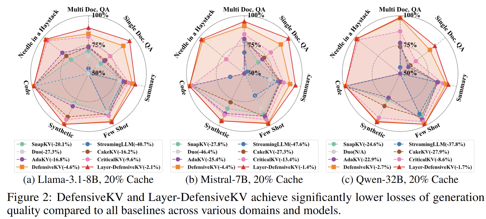
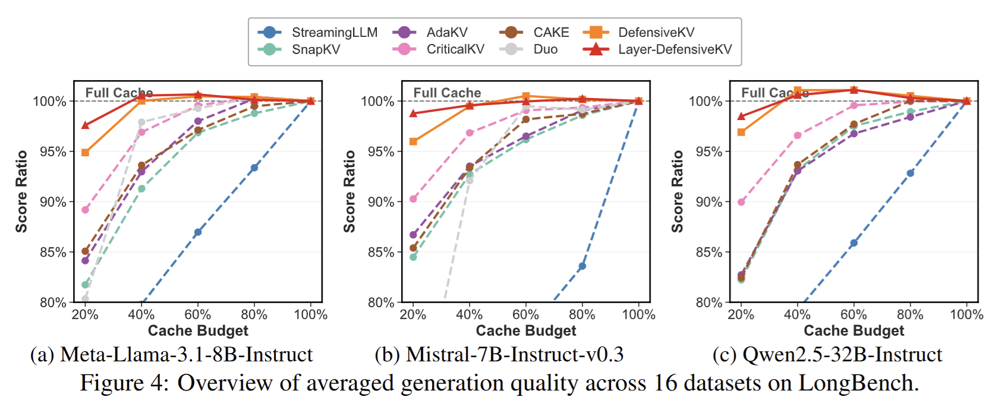

# DefensiveKV: Taming the Fragility of KV Cache Eviction in LLM Inference (ICLR 2026)

[](https://arxiv.org/pdf/2510.13334)

This repository contains the official implementation of **DefensiveKV** and **LayerDefensiveKV**, two novel KV cache compression methods introduced in our paper. This project is forked from the excellent [KVPRESS](https://github.com/NVIDIA/kvpress) library by NVIDIA but provides a more efficient implementation of head-wise KV-cache methods.

## Overview

We address the fragility of existing cache-eviction methods by introducing defensive aggregation. To demonstrate its effectiveness, we instantiate two cache-eviction methods:

- **DefensiveKV**: Introduces **defensive aggregation** on top of the current state-of-the-art method, (Ada-)CriticalKV.  
- **Layer-DefensiveKV**: Extends DefensiveKV by adopting AdaKV-style allocation, further enabling **layer-wise budget allocation**.





## Installation

```bash
# Clone the repository
git clone <repository-url>
cd defensive_kvpress

# Install dependencies
pip install -e .

# Build the kernel for efficient head-wise computation
cd kvpress/csrc/
make

# Install flash attention for better performance
pip install flash-attn --no-build-isolation
```

### Preparing Models and Datasets & set Environment Variables

Set the following environment variables before running evaluations:


```bash


# Preprocessed LongBench and 4K Ruler datasets are already provided in the datasets folder and can be downloaded directly.
git clone https://huggingface.co/datasets/yuanfengustc/defensivekv_dataset

export KVPRESS_DATASETS=/path/to/datasets  # Directory containing evaluation datasets 
export MODELS_DIR=/path/to/your/models  # Directory containing HuggingFace models
```

## A Real Quick Evaluation (≤ 1 hour)

We provide a quick evaluation on **10% of the RULER benchmark** to demonstrate the performance of **DefensiveKV** and **Layer-DefensiveKV** under 20\% cache size. The evaluation requires less than one hour on a single RTX 4090 and reproduces the results below.

```bash
cd evaluation
bash quick_evaluate.sh
```

| File Name | cwe | fwe | niah_multikey_1 | niah_multikey_2 | niah_multikey_3 | niah_multiquery | niah_multivalue | niah_single_1 | niah_single_2 | niah_single_3 | qa_1 | qa_2 | vt | average_score |
| :--- | :--- | :--- | :--- | :--- | :--- | :--- | :--- | :--- | :--- | :--- | :--- | :--- | :--- | :--- |
| SnapKV | 72.6 | 74 | 26 | 8 | 2 | 36.5 | 34 | 74 | 52 | 4 | 44 | 42 | 38 | 39.01 |
| AdaKV | 92.4 | 87.33 | 24 | 20 | 16 | 29.5 | 26.5 | 88 | 56 | 4 | 46 | 42 | 65.6 | 45.95 |
| AdaCriticalKV | 93.8 | 93.33 | 60 | 30 | 26 | 71 | 72 | 88 | 92 | 4 | 56 | 52 | 79.2 | 62.87 |
| DefensiveKV | **95.2** | 92 | 98 | 86 | 72 | 95.5 | 90 | **100** | **100** | 62 | **78** | 46 | 94.4 | 85.32 |
| LayerDefensiveKV | 93.6 | **94** | **100** | **98** | **92** | **100** | **94.5** | 98 | 96 | **92** | **78** | **56** | **96.4** | **91.42** |

## Comprehensive Evaluation (LongBench + RULER)

Run the following script to evaluate on **LongBench** and **RULER**:

```bash
cd evaluation
bash evaluate.sh
```

This script will:
1. Run DefensiveKV and Layer-DefensiveKV on LongBench with compression ratio 0.8 (20% Cache Size)
2. Run the same methods on RULER (4096 context length) with compression ratio 0.8 (20% Cache Size)
3. Save logs to `evaluation/logs/` directory

###  Press Names in Evaluation

- `efficient_defensivekv` - DefensiveKV (per-head)
- `efficient_layer_defensivekv` - GlobalDefensiveKV (global per-head)
- `criti_adasnapkv` - CriticalKV built on  AdaKV
- `adasnapkv` - AdaKV
- `snapkv` - SnapKV

### Analyzing Results

After running evaluations, use the provided scripts to analyze results:

```bash
cd evaluation/results

# Generate statistics from JSON result files
python statistic.py

```

## Method Details

### Defensive Mechanism

The core innovation of DefensiveKV is the defensive score adjustment:

```python
## Mechanism of Defensive Aggregation 

max_scores = scores.max(dim=2).values.max(dim=-2).values
scores = max_scores.clamp(min=max_scores.mean(dim=-1, keepdim=True))
```

## TODO

Future updates are listed below—feel free to open an issue or send a PR with ideas and feature requests:

- [X] Initialize release.
- [ ] Upgrade Transformers to v4.52 for Qwen-3 support.
- [ ] Qwen-3-MoE Support.

## Contact

For questions or discussions about this work, please open an issue in this repository. 

## Paper

If you find this work useful, please cite our paper:

```bibtex
@article{feng2025taming,
  title={Taming the Fragility of KV Cache Eviction in LLM Inference},
  author={Feng, Yuan and Guo, Haoyu and Lv, JunLin and Zhou, S Kevin and Xie, Xike},
  journal={arXiv preprint arXiv:2510.13334},
  year={2025}
}
```

**Paper Link**: [https://arxiv.org/pdf/2510.13334](https://arxiv.org/pdf/2510.13334)

## Acknowledgments

This project is built upon the [KVPRESS](https://github.com/NVIDIA/kvpress) library by NVIDIA. We thank the original authors for their excellent work on KV cache compression methods and the flexible framework that made this research possible.